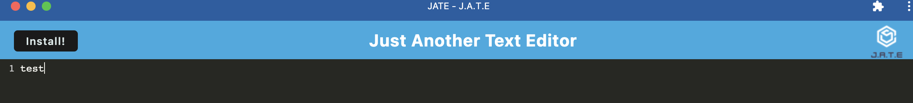
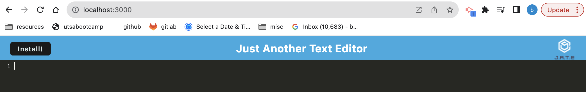

# pwatexteditor

## Description
For this project I completed the starter code to a text editor application that can be ran in the browser or installed on your desktop . The application can be ran online or offline. 

## Table of Contents
* [Visuals](#visuals)
* [Installation](#installation)
* [Usage](#usage)
* [License](#license)
* [Resources](#resources)
* [Questions](#questions)

## Visuals

## Installation 
App can be used from heroku link or select Install button to use in offline mode 

## Usage
This application can be used in the web browser or installed on the desktop . 

## Resources

AskBCS was very helpful in troubleshooting the initial build and run of the app in the terminal. I also referenced week 19 mini project and fellow class mate Jayne Valverde helped with bugs I had as well. 

## Questions
For any questions, please contact me @ 
https://github.com/bramirez09
or
Email: bramirez09@icloud.com